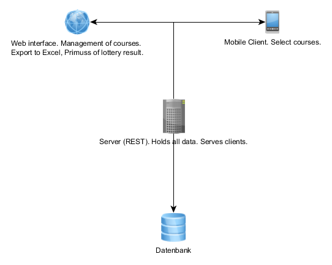

# Solution Strategy

>This page contains details regarding the Courses in English application, that especially are the >fundamental decisions and strategies that shape the systems architecture (Technology decisions, Architectural patterns, How to achieve quality goals, organizational decisions).

## Technology

The Courses in English application is aimed to be developed especially for use with mobile devices, which means Android and iOS. There are currently three different approaches which seem suitable:
1. [Flutter](https://flutter.io/)
1. [Native iOS Development](https://developer.apple.com/)
1. [Native Android Development](https://developer.android.com/)

All three ways provide natively running code, thus high performance and usability. Flutter is sticking out for its cross platform nature which makes it the primary technology.

## Architecture Pattern

Currently the architecture it is up to the decision whether we will use [Nine](https://nine.wi.hm.edu/) for our communication infrastructure.

Basically there are four roles which need to be defined:
1. User interface (Mobile Application)
1. Server (Handles as data provider for the application)
1. Database (Where the course data and selections are stored)
1. Management interface (Where the Courses in English administrators are able to edit data)

>**Nine** may be able to take up 3 of those roles (Server, Database and the Management Interface) but that has to be researched.

## Organization

The development teams are using Github as issue tracker, and central code repository. All communication is done via Github issues.