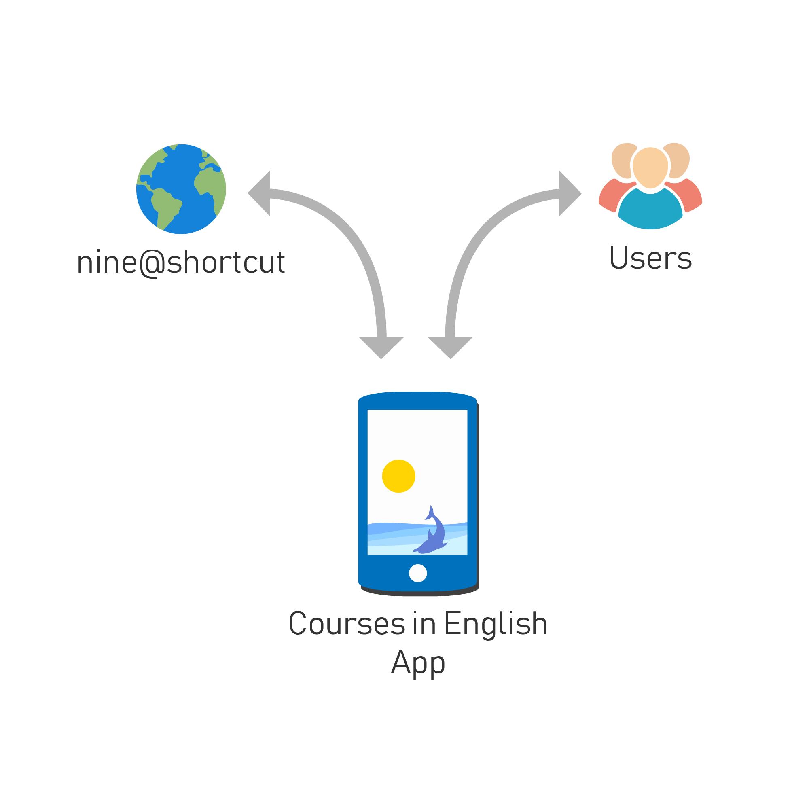

# System Scope and Context

The Courses in English app communicates (offers interfaces) with the [Nine](https://nine.wi.hm.edu) and the users.

## Business Context

| Name | Description |
| --- | --- |
| [Nine](https://nine.wi.hm.edu) | Web service which multiple faculties are already using. Defines a REST Web Service which the app is able to use. Integration of own functionality is possible. |
| Users | The Endusers (International students, etc.) using the mobile application. |

## Technical Context

The [Nine](https://nine.wi.hm.edu) is offering a REST Web Service, which the app is able to query data from. We are able to add own functionality.

> API Team is defining REST Interface for the Application.
